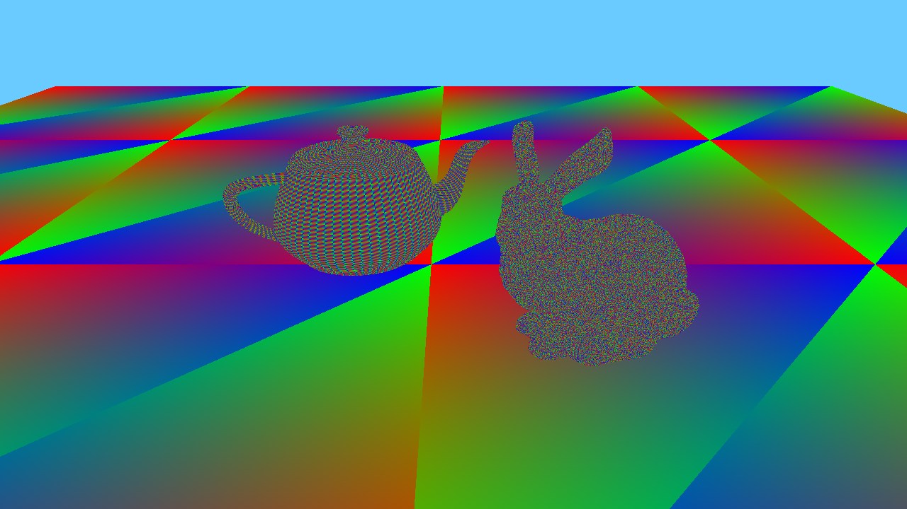
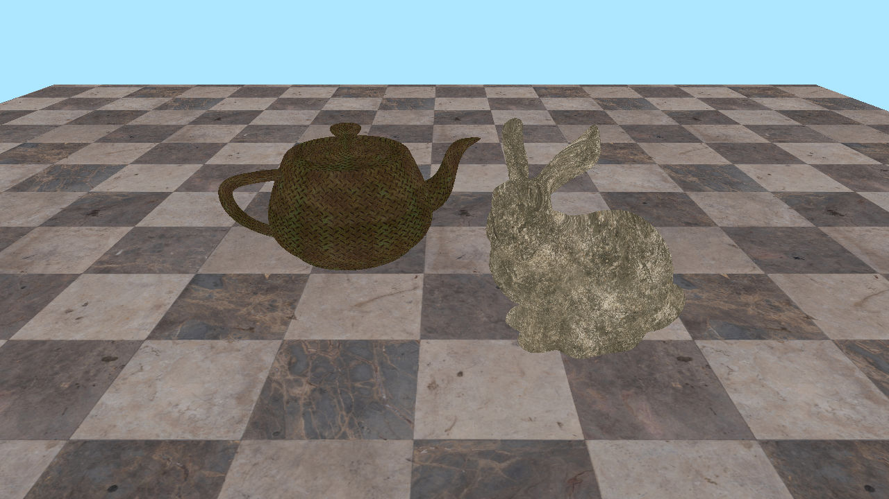
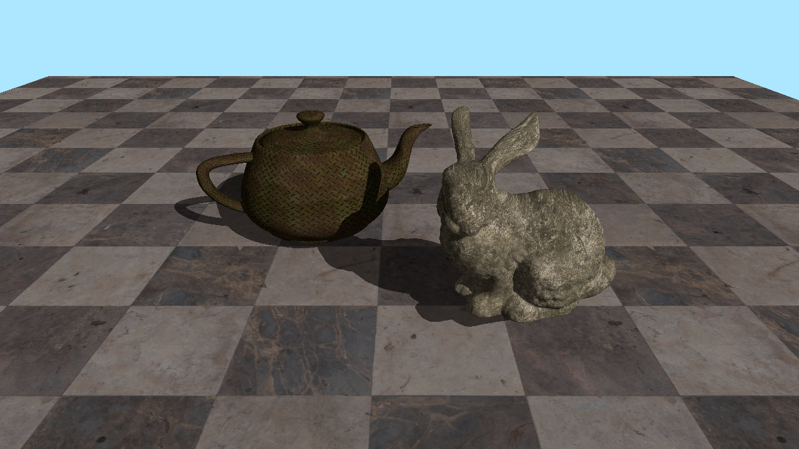
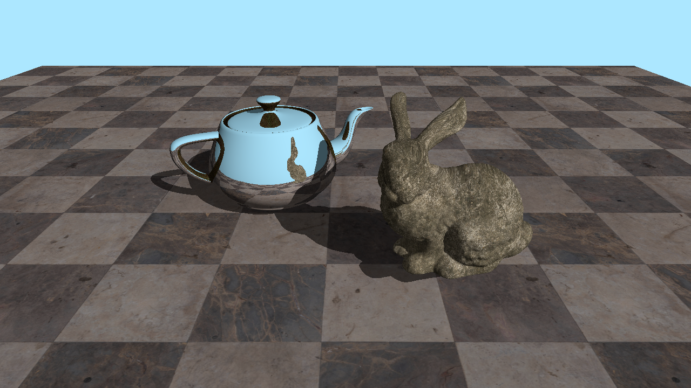
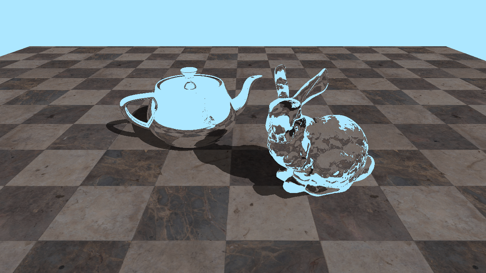
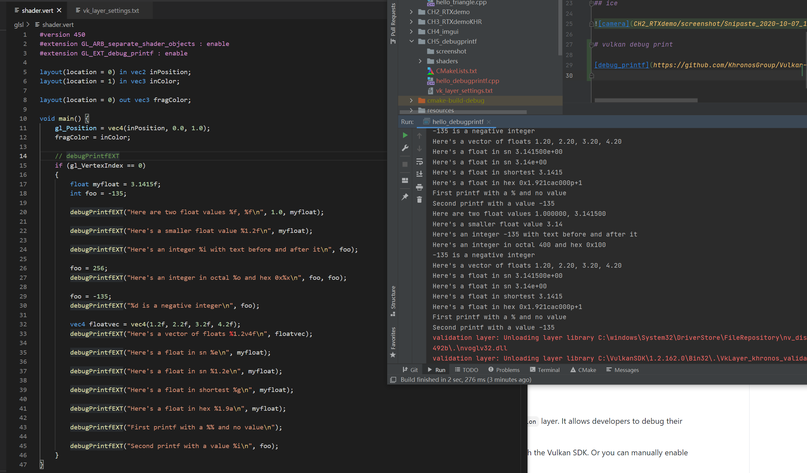

# vulkan-tutorial-hlsl

# vulkan ray tracing

- vulkan SDK 1.2.154.0

## camera

## texture

## light and shadow

## mirror

## ice

# vulkan debug print

[debug_printf](https://github.com/KhronosGroup/Vulkan-ValidationLayers/blob/master/docs/debug_printf.md)
